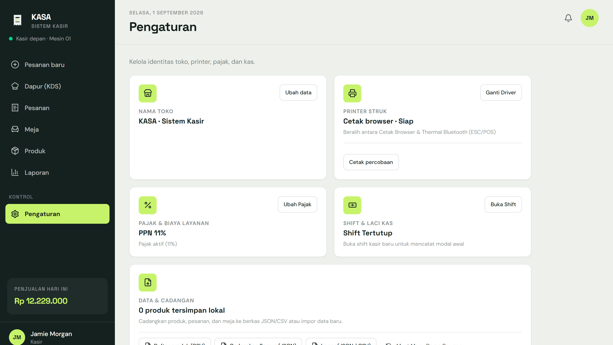

# KASA POS — Sistem Kasir & Manajemen Restoran

Aplikasi kasir (Point of Sale) dan manajemen pesanan berbasis web dengan arsitektur offline-first untuk operasional restoran, kedai kopi, dan usaha kuliner.


---

## Tangkapan Layar Aplikasi

| Modul | Gambar Antarmuka |
| :--- | :--- |
| **Kasir & Transaksi POS** |  |
| **QR Self-Order Meja Pelanggan** |  |
| **Layar Dapur (KDS)** |  |
| **Mode Pelayan Terisolasi** |  |
| **Tata Letak & Meja Makan** |  |
| **Katalog Produk & Menu** |  |
| **Laporan Penjualan** |  |
| **Pengaturan Shift & Printer** |  |

---

## Fitur Aplikasi

### 1. QR Self-Order Meja Pelanggan (`/order/:tableId`)
- Pelanggan scan barcode di meja makan menggunakan smartphone masing-masing.
- Terdeteksi otomatis nomor meja atau dapat memilih/ganti nomor meja langsung di layar.
- Mengisi nama pemesan, memilih menu berfoto dengan catatan item khusus.
- **Integrasi Langsung ke Dapur**: Pesanan langsung diteruskan ke Layar Dapur (KDS) tanpa antre ke kasir atau menunggu pelayan mencatat.
- **Pelayanan Langsung ke Meja**: Makanan diantar langsung oleh runner/pelayan ke nomor meja yang tertera di tiket KDS.
- **Opsi Pembayaran Fleksibel**: Bayar langsung via QRIS Mandiri atau Bayar Nanti saat selesai makan.
- **Live Cooking Tracker**: Pelanggan dapat memantau status memasak secara langsung (*Diterima* ➔ *Dimasak di Dapur* ➔ *Siap Diantar ke Meja*).

### 2. Multi-Pelayan Terisolasi (`/pelayan`)
- Sesi keranjang terisolasi per akun pelayan (`kasa_waiter_cart_${staffId}`) sehingga draf tidak bertabrakan.
- Deteksi & proteksi konflik meja (*Table Lock Indicator*): Menampilkan siapa pelayan yang sedang menangani meja tersebut.
- 3 Tab Kerja: *Catat Pesanan*, *Pesanan Saya (Active Orders)*, dan *Denah Meja Restoran*.
- Pergantian akun staf cepat menggunakan PIN 4 digit via numpad digital.

### 3. Kasir & Transaksi POS (`/`)
- Pencarian menu instan (`Ctrl + K`) dan filter kategori.
- Multi-tab keranjang per meja (pindah antar meja tanpa kehilangan draft pesanan).
- Penambahan catatan khusus per item (contoh: *less sugar, level pedas*).
- Diskon transaksi dinamis (persentase atau potongan nominal).
- Kalkulasi otomatis subtotal, diskon, service charge, dan pajak (PPN).
- Pembayaran tunai dengan hitung kembalian, QRIS dinamis, dan kartu.

### 2. Layar Dapur / Kitchen Display System (`/dapur`)
- Tiket pesanan masuk secara real-time untuk koki dan barista.
- Indikator durasi antrean dan penanda pesanan mendesak (> 15 menit).
- Transisi status satu klik: *Menunggu -> Dimasak -> Siap Saji -> Selesai*.
- Tampilan detail item beserta catatan kustom pelanggan.

### 3. Manajemen Meja & Area (`/meja`)
- Pengaturan tata letak meja makan, nomor meja, dan jumlah kursi.
- Input nama area bebas dengan rekomendasi cepat (*Utama, Teras, VIP, Rooftop, Lesehan*).
- Filter meja berdasarkan area dan visualisasi status meja aktif / kosong.
- Buka pesanan meja langsung dari kartu denah meja.

### 4. Katalog Produk (`/produk`)
- Tambah, edit, dan hapus menu makanan, minuman, dan camilan.
- Pengaturan harga jual, estimasi waktu masak, deskripsi, dan barcode scanner.

### 5. Shift Kasir & Rekonsiliasi Laci Kas (`/pengaturan`)
- Buka shift: pencatatan kasir bertugas dan modal awal uang kembalian.
- Tutup shift: rekonsiliasi otomatis antara rekap transaksi tunai sistem dengan uang fisik laci kas (deteksi selisih pas, surplus, atau minus).

### 6. Hardware Printer Thermal Bluetooth (ESC/POS)
- Integrasi langsung via Web Bluetooth API (GATT) tanpa software pihak ketiga.
- Generator biner ESC/POS untuk ukuran kertas 58mm dan 80mm.
- Mode fallback cetak dialog browser standar.

### 7. Cadangan Data & Laporan (`/laporan` & `/pengaturan`)
- Ekspor laporan penjualan ke format Excel (.xlsx).
- Cadangan penuh data lokal (produk, pesanan, meja, shift) ke file JSON.
- Impor data dari file JSON cadangan dan file spreadsheet CSV.

---

## Struktur Folder

```text
├── client/              # Frontend SPA (React 19 + TypeScript + Vite + Tailwind 4)
│   ├── src/
│   │   ├── components/  # Komponen UI, Cart, Modal, Context
│   │   ├── lib/         # Dexie IndexedDB schema & data repository
│   │   ├── pages/       # Kasir, Dapur, Pesanan, Meja, Produk, Laporan, Pengaturan
│   │   └── services/    # ESC/POS binary encoder & Bluetooth GATT driver
├── docs/                # Aset dokumentasi dan tangkapan layar antarmuka
├── server/              # Backend opsional (Laravel 11 REST API & Filament Admin)
└── capacitor/           # Konfigurasi wrapper native Android/iOS
```

---

## Cara Menjalankan Aplikasi

### Kebutuhan Sistem
- Node.js 18+
- pnpm / npm / yarn
- PHP 8.2+ & Composer (hanya jika ingin menjalankan server Laravel)

### 1. Menjalankan Frontend
```bash
cd client
pnpm install
pnpm dev
```
Buka browser pada alamat `http://localhost:5173`.

### 2. Menjalankan Backend Laravel (Opsional)
```bash
cd server
composer install
cp .env.example .env
php artisan key:generate
php artisan migrate --seed
php artisan serve
```

### 3. Build Produksi
```bash
cd client
pnpm build
```
Hasil build statis dan service worker PWA berada di folder `client/dist`.

---

## Lisensi
MIT
