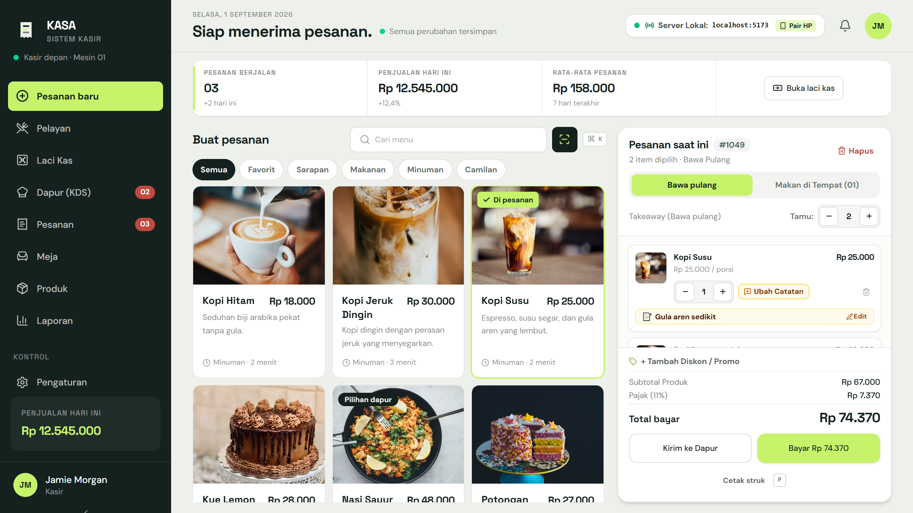
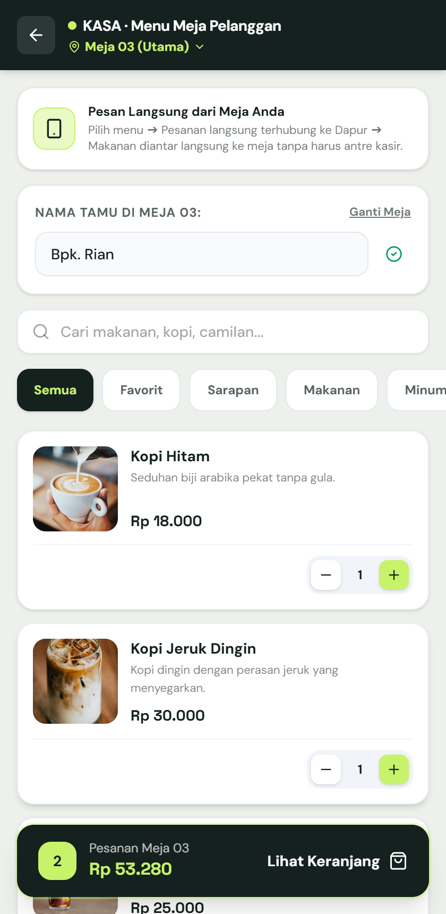
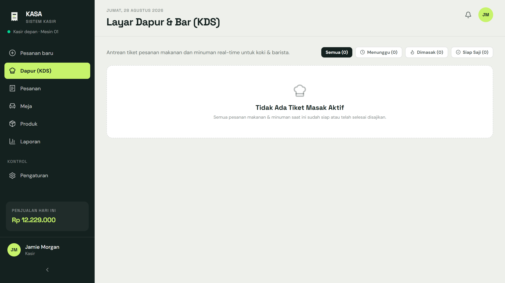
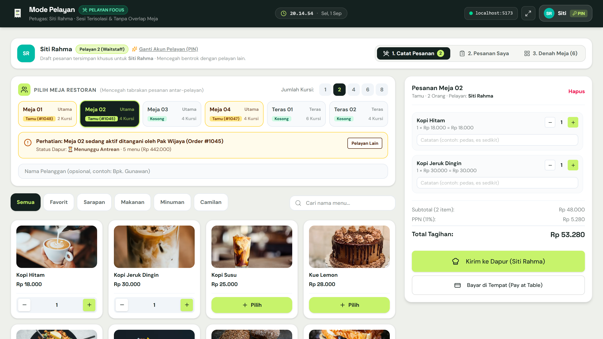
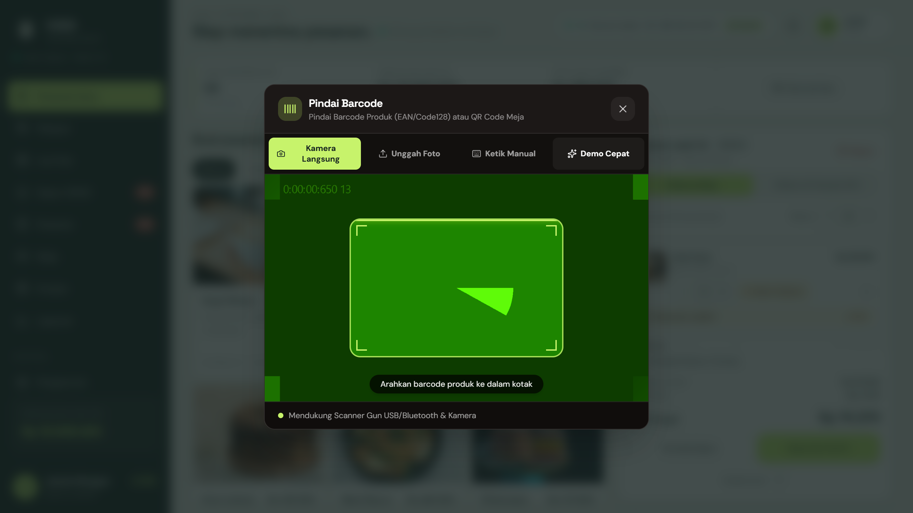
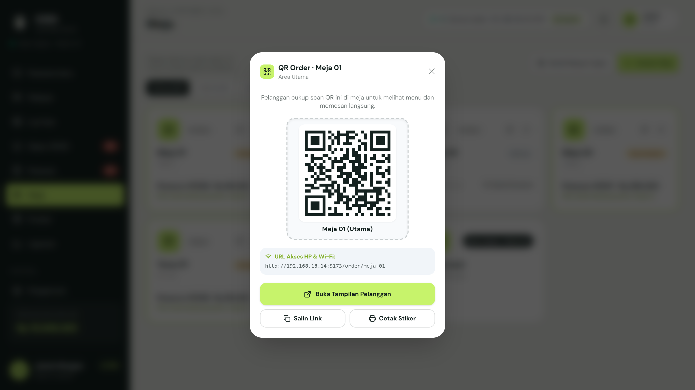
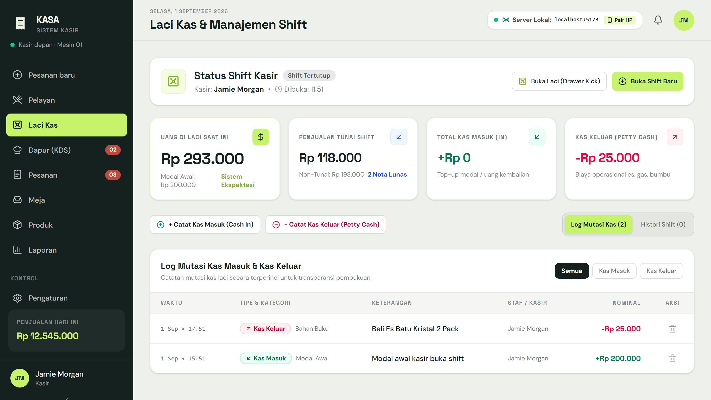
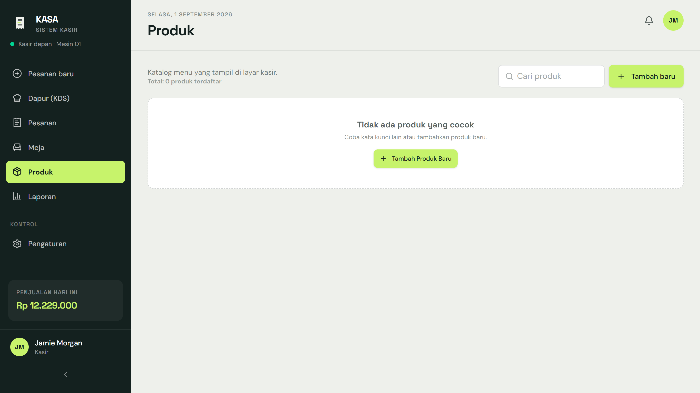
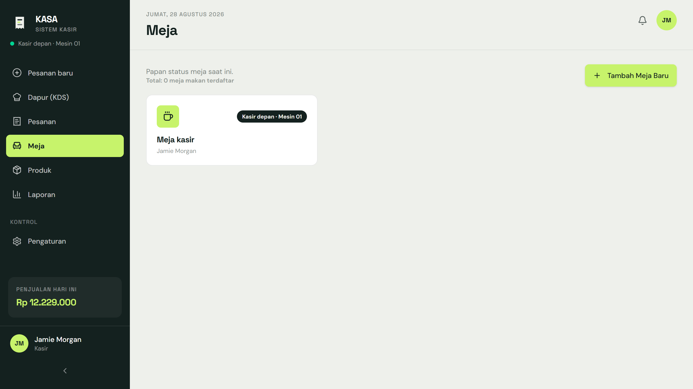
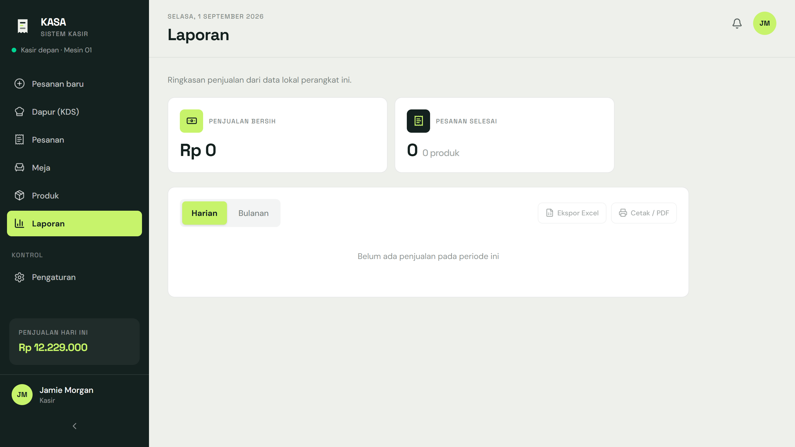

<div align="center">

# 🍽️ KASA POS — Sistem Kasir & Manajemen Restoran Modern

**Sistem Point of Sale (POS), Layar Dapur KDS, Multi-Pelayan, Self-Order QR, dan Manajemen Restoran Offline-First.**

[](https://react.dev/)
[](https://www.typescriptlang.org/)
[](https://vitejs.dev/)
[](https://tailwindcss.com/)
[](https://dexie.com/)
[](https://web.dev/progressive-web-apps/)
[](LICENSE)

<br/>



</div>

---

## 🌟 Ringkasan Keunggulan

KASA dirancang khusus untuk kebutuhan operasional kuliner (restoran, cafe, warung, kedai kopi) yang membutuhkan **kecepatan tinggi, stabilitas tanpa internet (offline-first), dan kolaborasi multi-perangkat di jaringan lokal**.

- ⚡ **100% Offline-First**: Data tersimpan di browser via IndexedDB (Dexie.js). Aplikasi tetap beroperasi lancar meskipun internet terputus.
- 📱 **QR Self-Order Meja**: Pelanggan memindai QR di meja mereka, memilih menu, dan pesanan langsung masuk ke antrean dapur secara otomatis.
- 👨‍🍳 **Kitchen Display System (KDS)**: Antrean memasak visual untuk koki dengan indikator waktu, kartu tiket multi-pelayan, dan update status real-time.
- 🚶 **Mode Pelayan Keliling (Waitstaff)**: Antarmuka mobile responsif dengan isolasi keranjang per pelayan dan indikator pencegahan tabrakan meja (*Table Lock*).
- 🔫 **Multi-Engine Barcode & QR Scanner**: Mendukung *Hardware Scanner Gun* USB/Bluetooth HID, pemindai kamera ZXing (1D/2D), unggah gambar, dan audio beep sintetis Web Audio API.
- 👥 **Role-Based Access Control (RBAC)**: Proteksi PIN 4 digit untuk Kasir/Admin, Pelayan, Dapur, dan Manajer dengan pembatasan hak akses rute (*RouteGuard*).
- 🖨️ **Thermal Receipt Printer Bluetooth & USB**: Driver ESC/POS biner untuk kertas 58mm & 80mm via Web Bluetooth API tanpa aplikasi pihak ketiga.
- 💰 **Laci Kas & Rekonsiliasi Shift**: Buka/tutup shift kasir, pencatatan modal awal, dan deteksi otomatis selisih kas fisik vs sistem.

---

## 📸 Galeri Antarmuka

| Modul | Tampilan Antarmuka |
| :--- | :--- |
| **Kasir Utama (POS)**<br/>*Pencarian instan, multi-cart, diskon, QRIS, & cetak struk* |  |
| **QR Self-Order Pelanggan**<br/>*Scan di meja, pesan menu, & lacak status masak live* |  |
| **Layar Dapur (KDS)**<br/>*Tiket pesanan real-time, timer masak, & tombol siap saji* |  |
| **Mode Fokus Pelayan**<br/>*Input pesanan keliling, sesi terisolasi, & denah meja* |  |
| **Pemindai Barcode & QR**<br/>*Kamera ZXing, Scanner Gun USB, audio beep, & keypad* |  |
| **Pusat Jaringan & Sinkronisasi**<br/>*Pairing QR untuk HP pelayan, layar dapur, & WiFi meja* |  |
| **Laci Kas & Rekonsiliasi**<br/>*Perhitungan fisik uang laci vs rekap penjualan shift* |  |
| **Katalog & Gambar Produk**<br/>*Upload foto lokal, pencarian Google, & galeri kuliner* |  |
| **Manajemen Meja Restoran**<br/>*Denah area (Utama, VIP, Teras) & generator cetak QR Meja* |  |
| **Laporan Penjualan**<br/>*Grafik omset, rekap metode bayar, & ekspor data Excel* |  |

---

## 🔑 Akun & PIN Default (Role-Based Access)

Sistem dilengkapi tombol ganti akun cepat (*Quick Switch*) dengan proteksi PIN 4 digit:

| Nama Staf | Peran (*Role*) | PIN Default | Hak Akses Rute |
| :--- | :--- | :--- | :--- |
| **Jamie Morgan** | `Kasir & Admin` | `1234` | Akses penuh: POS, Meja, Produk, Laci Kas, Laporan, Pengaturan, Pelayan, Dapur |
| **Budi Santoso** | `Pelayan 1` | `2222` | Khusus Mode Pelayan (`/pelayan`) & Pesanan Meja |
| **Siti Rahma** | `Pelayan 2` | `2223` | Khusus Mode Pelayan (`/pelayan`) & Pesanan Meja |
| **Agus Pratama** | `Pelayan 3` | `2224` | Khusus Mode Pelayan (`/pelayan`) & Pesanan Meja |
| **Chef Junaedi** | `Kepala Dapur` | `3333` | Khusus Layar Dapur KDS (`/dapur`) |
| **Hendra Wijaya** | `Manajer` | `8888` | Laporan Keuangan, Ringkasan Pesanan, Laci Kas, Pengaturan, & Meja |

---

## 🛠️ Fitur & Modul Utama

### 1. 🛒 Kasir & Transaksi POS (`/`)
- **Pencarian Cepat (`Ctrl + K`)**: Cari menu berdasarkan nama atau SKU barcode.
- **Multi-Tab Cart Meja**: Simpan draf transaksi di beberapa meja tanpa takut data hilang saat beralih.
- **Kustomisasi Pesanan**: Tambahkan catatan per item (*less sugar, tanpa bawang, pedas sedang*).
- **Kalkulasi Otomatis**: Subtotal, diskon (persen/nominal), biaya layanan (*Service Charge*), dan Pajak Pertambahan Nilai (PPN 11%).
- **Multi-Metode Pembayaran**: Tunai dengan kalkulator uang kembalian cepat, QRIS Dinamis Mandiri, Kartu Debit/Kredit, dan Transfer Bank.

### 2. 📲 QR Self-Order Pelanggan (`/order/:tableId`)
- **Tanpa Unduh Aplikasi**: Pelanggan cukup scan QR Code yang tertempel di meja makan mereka.
- **Bypass Kasir & Pelayan**: Pesanan langsung diteruskan ke Kitchen Display System (KDS) di dapur.
- **Live Cooking Status**: Pelanggan dapat memantau proses memasak (*Pesanan Diterima* ➔ *Sedang Dimasak* ➔ *Siap Diantar ke Meja*).
- **Opsi Bayar Fleksibel**: Pembayaran langsung di meja via QRIS atau opsi bayar di kasir saat selesai makan.

### 3. 👨‍🍳 Layar Dapur / Kitchen Display System (`/dapur`)
- **Realtime Ticket Queue**: Tiket pesanan masuk seketika dari kasir, pelayan, maupun pelanggan self-order.
- **Status 3 Tahap**: Tombol transisi cepat `Mulai Masak` ➔ `Siap Disajikan` ➔ `Selesai`.
- **Timer & Urgent Alert**: Penghitung waktu otomatis dengan tanda peringatan visual untuk pesanan di atas 15 menit.
- **Indikator Asal Pesanan**: Label jelas untuk membedakan pesanan Pelayan (Budi/Siti), Kasir, atau Self-Order Meja.

### 4. 🚶 Mode Pelayan Fokus (`/pelayan`)
- **Isolasi Draft**: Sesi keranjang tersimpan per staf (`kasa_waiter_cart_${staffId}`) mencegah tumpang tindih pesanan.
- **Table Lock Protection**: Memberi tahu jika meja tertentu sedang aktif ditangani oleh pelayan lain.
- **3 Tab Operasional**: *1. Catat Pesanan*, *2. Pesanan Saya (Active Orders)*, dan *3. Denah Meja (Layout)*.

### 5. 🔫 Sistem Barcode & QR Multi-Engine
- **Hardware Barcode Gun (USB / Bluetooth HID)**: Menangkap ketukan berkecepatan tinggi scanner fisik secara pasif di kasir tanpa perlu klik form.
- **Kamera Scanner (ZXing Multi-Format)**: Memindai barcode 1D (*EAN-13, EAN-8, Code 128, Code 39, UPC*) dan 2D (*QR Code, Data Matrix*) dengan algoritma `TRY_HARDER`.
- **Web Audio Beep**: Synthesizer audio asli (*high chime* saat sukses dan *low buzz* saat error) tanpa ketergantungan file audio eksternal.
- **4 Tab Pemindai**: *Kamera Langsung* (dengan targeting reticle dan laser), *Unggah Foto*, *Ketik Manual*, dan *Demo Cepat*.

### 6. 💵 Laci Kas & Rekonsiliasi Shift (`/laci-kas` & `/pengaturan`)
- **Buka Shift**: Pencatatan kasir bertugas dan modal awal uang kembalian.
- **Tutup Shift & Rekonsiliasi**: Input hitungan fisik uang kertas & koin, sistem otomatis membandingkan dengan total penerimaan tunai sistem dan mendeteksi selisih (pas, surplus, minus).
- **Riwayat Shift**: Log riwayat shift tersimpan rapi untuk kebutuhan pembukuan.

### 7. 🖨️ Hardware Thermal Receipt Printer (ESC/POS)
- **Web Bluetooth GATT**: Terhubung langsung ke printer thermal portable 58mm / 80mm tanpa driver software desktop.
- **Format Struk Lengkap**: Header nama resto, nomor meja/pelanggan, daftar pesanan + catatan, rincian diskon/pajak, QRIS, dan footer struk.
- **Fallback Cetak Standar**: Opsi dialog print browser (`window.print()`) untuk printer kabel USB/LAN.

### 8. 🌐 Pusat Jaringan & Panduan Server Lokal
- **Pairing QR Code**: Menampilkan IP jaringan lokal (contoh: `192.168.18.14:5173`) untuk menghubungkan HP pelayan dan tablet dapur dengan satu scan.
- **WiFi QR Generator**: Buat dan cetak kartu QR WiFi restoran untuk pelanggan.

---

## 🏗️ Struktur Arsitektur & Folder

```text
├── client/                      # Frontend SPA (React 19 + TypeScript + Vite + Tailwind 4)
│   ├── public/                  # Ikon PWA, manifest, favicon
│   ├── scripts/                 # Otomasi pengujian E2E & visual Puppeteer
│   └── src/
│       ├── components/          # Komponen UI, BarcodeScanner, CartPanel, RouteGuard, Modals
│       ├── hooks/               # Custom hooks (useBarcodeGunScanner, etc.)
│       ├── lib/                 # Database Dexie.js, Audio Feedback, Exporters, Sync Bus
│       ├── pages/               # Home (Kasir), WaiterOrder, Kitchen, CustomerSelfOrder,
│       │                        # CashDrawer, Orders, Tables, Products, Reports, Settings
│       └── services/            # ESC/POS binary encoder & Bluetooth GATT driver
├── docs/                        # Tangkapan layar antarmuka & dokumentasi panduan
├── server/                      # Backend opsional (Laravel 11 REST API)
└── capacitor/                   # Konfigurasi wrapper native Android/iOS
```

---

## 🚀 Panduan Instalasi & Menjalankan

### Kebutuhan Sistem
- **Node.js**: versi 18.0.0 atau lebih baru
- **Package Manager**: `npm`, `pnpm`, atau `yarn`
- **Browser Modern**: Google Chrome, Microsoft Edge, atau browser berbasis Chromium (disarankan untuk Web Bluetooth & Barcode Scanner API).

### 1. Clone Repository
```bash
git clone https://github.com/Binis-code/kasir-restoran.git
cd kasir-restoran
```

### 2. Jalankan Frontend KASA
```bash
cd client
npm install
npm run dev
```
Aplikasi kasir akan aktif di `http://localhost:5173`.

### 3. Hubungkan Perangkat di Jaringan WiFi yang Sama
- Dapatkan alamat IP laptop kasir (misal: `http://192.168.1.10:5173`).
- Buka di HP Pelayan: `http://192.168.1.10:5173/pelayan`
- Buka di Tablet Dapur: `http://192.168.1.10:5173/dapur`
- Buka QR Meja Pelanggan: `http://192.168.1.10:5173/order/meja-01`

### 4. Build untuk Produksi
```bash
cd client
npm run build
```
Hasil build statis dan Service Worker PWA siap di-deploy di folder `client/dist`.

---

## 🧪 Pengujian Otomatis (E2E Testing)

KASA dilengkapi suite pengujian otomatis berbasis Puppeteer untuk memverifikasi fungsionalitas dan mencegah regresi visual:

```bash
cd client
node scripts/test-barcode-qr-fix.mjs     # Uji scanner kamera, demo, hardware gun, & table QR
node scripts/test-multi-waiter.mjs       # Uji sesi terisolasi multi-pelayan & table locking
node scripts/test-self-order.mjs         # Uji alur self-order meja ke KDS real-time
```

---

## 📄 Lisensi

Proyek ini dilisensikan di bawah lisensi **MIT License** — bebas digunakan dan dikembangkan untuk keperluan komersial maupun pribadi.
